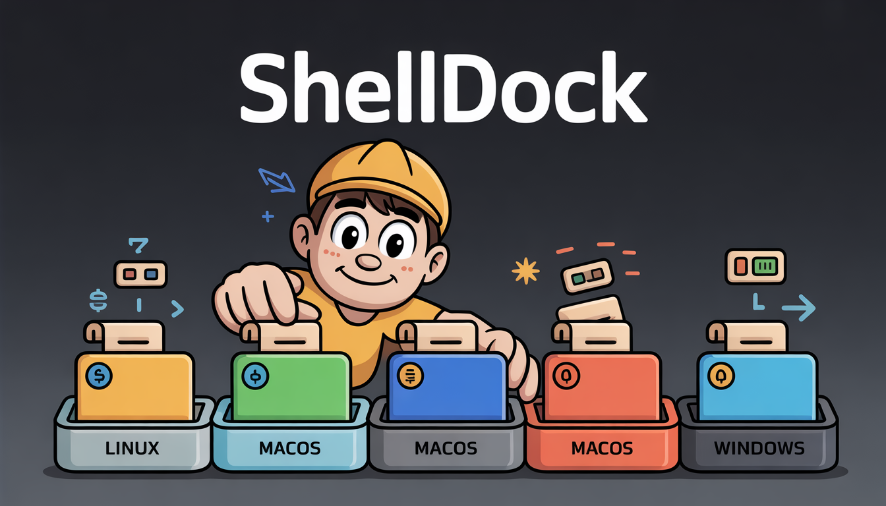

<div align="center">
  

  <p><strong>A fast, cross-platform shell command repository manager.</strong></p>
  <p>Save, organize, and execute shell commands from a bundled repository or local directory — with platform-specific support, versioning, dynamic arguments, and an interactive terminal UI.</p>

  [](LICENSE)
  [](go.mod)
  [](https://github.com/OpsGuild/ShellDock/releases/latest)
</div>

---

## Why ShellDock?

How many times have you Googled the same installation commands, dug through shell history, or copy-pasted from a stale wiki? ShellDock gives you a single CLI to store, version, and run command recipes — with built-in platform detection so the same command set works on Ubuntu, CentOS, Arch, macOS, and Windows.

**Key highlights:**

- ⚡ **Fast** — Native Go binary, zero runtime dependencies
- 📦 **Batteries included** — Ships with curated command sets for Docker, Git, Node.js, Python, Nginx, and more
- 💾 **Local-first** — Your custom command sets live in `~/.shelldock` and always take priority
- 🖥️ **Cross-platform** — Automatic OS detection with per-step platform-specific commands
- 🎨 **Interactive TUI** — Create, edit, and manage command sets from a full terminal UI
- 🔄 **Versioning & tags** — Multiple versions per command set with human-friendly tag names
- 🔧 **Dynamic arguments** — Runtime parameters via `--args` or interactive prompts

---

## Installation

### Quick Install (Linux & macOS)

```bash
curl -fsSL https://shelldock.opsguild.tech/install.sh | bash
```

### Package Managers

| Platform | Command |
|---|---|
| **macOS (Homebrew)** | `brew install OpsGuild/tap/shelldock` |
| **Debian / Ubuntu** | `curl -fsSL https://raw.githubusercontent.com/OpsGuild/ShellDock/master/scripts/install-apt.sh \| sudo bash` |
| **Arch Linux (AUR)** | `yay -S shelldock` |
| **Windows (Chocolatey)** | `choco install shelldock` |
| **Snap** | `sudo snap install shelldock` |

### Build from Source

```bash
git clone https://github.com/OpsGuild/ShellDock.git
cd ShellDock
make build
sudo make install
```

> **Prerequisites:** Go 1.21+, Make (optional)

For detailed installation options — including RPM, Flatpak, direct binary downloads, updating, and uninstalling — see the **[Installation Guide](docs/INSTALLATION.md)**.

---

## Quick Start

**Run a command set:**

```bash
shelldock docker
```

**List everything available:**

```bash
shelldock list
```

**Preview without executing:**

```bash
shelldock show docker
```

**Manage commands with the interactive TUI:**

```bash
shelldock manage
```

**Run a specific version or tag:**

```bash
shelldock docker@v2
shelldock certbot@nginx
```

**Skip or pick steps:**

```bash
shelldock docker --skip 1,2
shelldock docker --only 3-5
```

**Pass dynamic arguments:**

```bash
shelldock git --args name="Jane Doe",email="jane@example.com"
```

When you run a command set, ShellDock previews every step and prompts before executing:

```
📦 Command Set: docker
📝 Description: Docker installation and setup commands
🔢 Version: v1
🖥️  Platform: ubuntu
📋 Commands to execute:

  1. Update package index
     $ apt-get update

  2. Install Docker
     $ curl -fsSL https://get.docker.com -o get-docker.sh && sh get-docker.sh

  3. Start Docker service
     $ systemctl start docker

Do you want to execute these commands? [a]ll/[y]es step-by-step/[N]o:
```

- **`a`** — Run all steps without further prompts
- **`y`** — Step-by-step, confirm each one
- **`N`** — Cancel

Use `-a` to skip prompts entirely: `shelldock docker -a`

---

## Command Overview

| Command | Description |
|---|---|
| `shelldock <name>` | Run a command set |
| `shelldock show <name>` | Preview commands without executing |
| `shelldock echo <name>` | Output commands in copyable format |
| `shelldock list` | List all available command sets |
| `shelldock manage` | Interactive TUI for managing command sets |
| `shelldock versions <name>` | List available versions |
| `shelldock config show` | Show current configuration |
| `shelldock config set <platform>` | Set platform (ubuntu, centos, darwin, etc.) |
| `shelldock sync` | Sync from cloud repository |

See the **[Command Reference](docs/COMMAND_REFERENCE.md)** for every flag and option with examples.

---

## Bundled Repository

ShellDock ships with ready-to-use command sets organized by category:

```
repository/
├── databases/   # postgres, mysql (+ mariadb), redis
├── devops/      # docker, docker-compose, kubernetes, pm2, terraform, ansible
├── editors/     # nvim
├── languages/   # go, nodejs, python, rust
├── network/     # alias-ip, reset-network
├── security/    # openssh, ufw, fail2ban, unattended-upgrades
├── system/      # swap, sysinfo, cleanup, hostname, timezone, users
├── vcs/         # git
└── web/         # nginx, certbot, caddy
```

Subdirectories are transparent — just use `shelldock docker`, not `shelldock devops/docker`.

Your custom command sets in `~/.shelldock/` are always checked first and can override any bundled set.

---

## Security

ShellDock executes shell commands on your system. Every command is stored in plain YAML and can be inspected before execution:

```bash
shelldock show docker        # preview every step — nothing is executed
shelldock echo docker | less # read raw commands in a pager
```

When you run a command set without `-a`, ShellDock shows a full preview and lets you confirm each step individually. There are no hidden scripts, no telemetry, and no automatic privilege escalation.

Read the **[Security Guide](docs/SECURITY.md)** for the full trust model, best practices, and how to report vulnerabilities.

---

## Documentation

| Document | Description |
|---|---|
| **[Quick Start](docs/QUICKSTART.md)** | Get up and running in minutes |
| **[Installation](docs/INSTALLATION.md)** | All installation methods, updating, and uninstalling |
| **[Usage Guide](docs/USAGE.md)** | Configuration, execution, versioning, platform support |
| **[Command Reference](docs/COMMAND_REFERENCE.md)** | Every command and flag with examples |
| **[Command Set Format](docs/COMMAND_SET_FORMAT.md)** | YAML specification, multi-version, dynamic arguments |
| **[Security](docs/SECURITY.md)** | Trust model, inspecting commands, best practices |
| **[Features](docs/FEATURES.md)** | Detailed feature descriptions |
| **[Bash Completion](docs/BASH_COMPLETION.md)** | Shell autocompletion setup |
| **[Testing](docs/TESTING.md)** | Unit and integration test guide |
| **[Manual Testing](docs/MANUAL_TESTING.md)** | Manual testing checklist |
| **[Contributing](docs/CONTRIBUTING.md)** | Development setup, project structure, guidelines |

---

## Contributing

Contributions are welcome! See the **[Contributing Guide](docs/CONTRIBUTING.md)** for development setup, testing, and how to add command sets.

```bash
git clone https://github.com/OpsGuild/ShellDock.git
cd ShellDock
go mod download
make test
```

---

## License

MIT License — see [LICENSE](LICENSE) for details.

---

<div align="center">
  <strong>Made with ❤️ for developers who love automation</strong>
</div>
